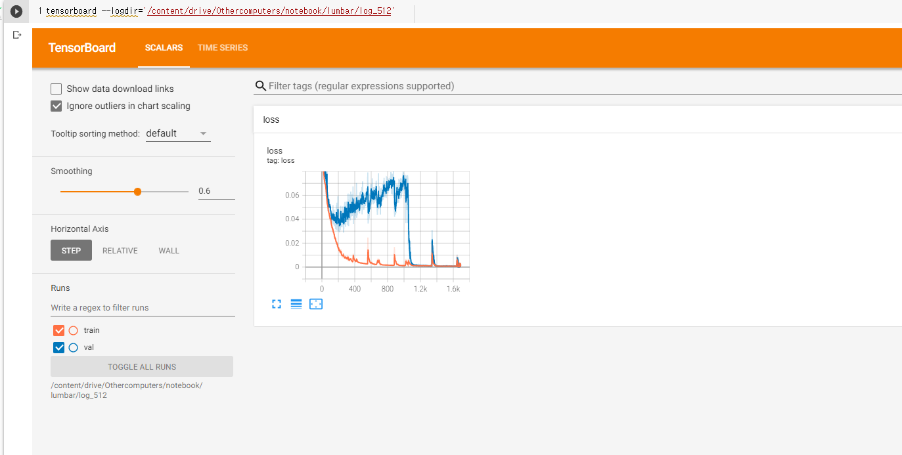

원래 있지만 100mb이상이라 첨부할 수 없었다.
여기 데이터로 tensorboard를 통해 loss의 변화를 아래처럼 살펴볼 수 있다.

위의 loss가 갑자기 준 건 사실 정확도를 조금이라도 올리고자 하는 마음에 갑자기 준 저기서는 
val에 해당하는 파일도 모두 train에 포함되어 val를 할 수 있는 file이 없어졌기 때문이다.

val :validation

만약 이 파일을 확인하고 싶다면 아래에 접근해주세요

log_512
https://drive.google.com/drive/folders/1VwdY3ex_Ly9C8m2kjolz69iJP7qJNxOJ?usp=sharing

log_256
https://drive.google.com/drive/folders/1VyyQATP0mlQ6zktlvHEvaBxBiFVdLLzW?usp=sharing